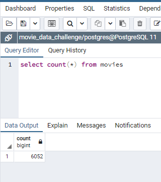
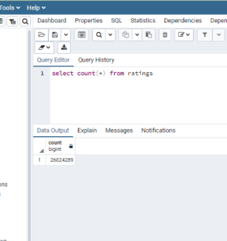

# Movies - Extract, Transform and Load (ETL)

## Purpose
Amazing Prime Video is a platform for streaming movies and TV shows. The project's goal is to develop an algorithm to predict which low-budget movies will become popular, beforehand.  The end goal is to purchase streaming rights at a bargain.   

## Data Sources
Data was extracted from the following 2 sources:
1. Wikipedia (for all movies released since 1990)
2. Movieland website's rating data.  

## Deliverables 
1. Write an ETL Function to Read Three Data Files. (Python in Jupyter Notebook)
2. Extract and Transform the Wikipedia Data. (Python in Jupyter Notebook)
3. Extract and Transform the Kaggle data. (Python in Jupyter Notebook)
4. Create the Movie Database within PostgreSQL. (In pgAdmin4)

## Working Files  
Located within this GitHub repository:

1. ETL_function_test.ipynb
2. ETL_clean_wiki_movies.ipynb
3. ETL_clean_kaggle_data.ipynb
4. ETL_create_database

## Data Files 
Located within this GitHub repository:

1. movies_metadasta.csv (within archive - Copy.zip)
2. ratings_small.csv (within archive - Copy.zip)  -- The full file, referenced within the Python code, was far too large to post to GitHub.  Therefore, a smaller version was posted to provide an example of the data within.)
3. wikipedia-movies.json

----------------------------------------------------------------------------------
### Appendix of Figures and Tables
----------------------------------------------------------------------------------

 
 
**Fig. 1:  Movies Query (6,052 Rows)**
 
 
 

 
 
**Fig. 2:  Ratings Query (26,024,289 Rows)**
 
 
 
